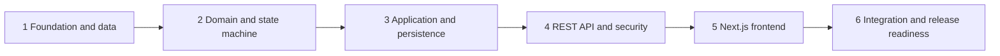

# Implementation Plan — Support Ticket Management System

## Purpose

This document breaks v1 delivery into **six sequential phases**. Each phase builds on the previous one. Behavior is defined in `/spec`; normative coding rules live in `/rules`.

| Spec | Role in delivery |
| --- | --- |
| [requirements.md](../spec/requirements.md) | Scope, actors, acceptance criteria (TCK-*) |
| [architecture.md](../spec/architecture.md) | Layering, packages, security, deployment |
| [data-model.md](../spec/data-model.md) | PostgreSQL schema, indexes, constraints |
| [state-machine.md](../spec/state-machine.md) | Authoritative ticket lifecycle |
| [api-contract.md](../spec/api-contract.md) | HTTP resources, errors, pagination |
| [ui-flow.md](../spec/ui-flow.md) | Next.js routes, UX, component map |
| [test-strategy.md](../spec/test-strategy.md) | Pyramid, matrix tests, CI gates |

**Stack (v1):** Java 21, Spring Boot 3.x, PostgreSQL, React/Next.js (App Router).

**Out of scope for this plan:** Writing application code in this document; user-management UI; features listed as out of scope in requirements.

---

## Phase overview

| Phase | Goal | Primary outputs |
| --- | --- | --- |
| 1 | Runnable backend skeleton with correct schema | Migrations, JPA entities, local DB |
| 2 | Workflow rules without Spring | Domain aggregate, transition policy, unit tests |
| 3 | Use cases and queries | Application services, repositories, mappers |
| 4 | Contract-compliant HTTP API | Controllers, JWT authz, Problem Details |
| 5 | Spec-aligned UI | List, create, detail, comments, transitions |
| 6 | Confidence to ship | Integration/E2E tests, compose stack, CI |

---

## Phase 1 — Foundation and data layer

**Objective:** Stand up the Spring Boot project, PostgreSQL connectivity, and schema that match [data-model.md](../spec/data-model.md).

### Tasks

1. **Initialize backend modules** — Create the `ticket-api` (or monorepo `backend/`) Spring Boot 3.x project on Java 21 with package layout from [architecture.md](../spec/architecture.md): `ticket.api`, `ticket.application`, `ticket.domain`, `ticket.infrastructure`. Add Actuator health endpoints and baseline `application.yml` (profile-based config, no secrets in repo).

2. **Add database migrations** — Introduce Flyway or Liquibase and versioned scripts for `ticket` and `ticket_comment` tables: columns, check constraints on `status` and `priority`, FK `ticket_comment.ticket_id` → `ticket(id)` with `ON DELETE RESTRICT`, and indexes (`idx_ticket_status`, `idx_ticket_created_at`, `idx_ticket_requester`, `idx_ticket_assignee`, `idx_comment_ticket_created`). Document chosen search index strategy (e.g. `ILIKE` with btree/GIN) in migration comments.

3. **Implement JPA infrastructure entities** — Map `ticket` (including `@Version` on `version`, `timestamptz` for audit fields) and `ticket_comment` per data model. Keep entities in `infrastructure`; do not expose them from controllers.

4. **Optional audit table** — If team adopts v1 optional `ticket_status_history`, add migration and entity; otherwise record the decision to defer and rely on current `status` only (tests still assert transitions on `ticket` row).

5. **Local developer database** — Provide `docker-compose` (or documented equivalent) for PostgreSQL; verify migrations apply cleanly on empty DB and application starts with `dev` profile.

### Phase 1 exit criteria

- Migrations apply idempotently; schema matches data-model spec.
- Application boots and health check passes against local PostgreSQL.

---

## Phase 2 — Domain model and state machine

**Objective:** Implement ticket lifecycle as **pure domain logic** per [state-machine.md](../spec/state-machine.md), testable without Spring ([test-strategy.md](../spec/test-strategy.md)).

### Tasks

1. **Define domain types** — Enums `TicketStatus`, `TicketPriority`, `TransitionEvent`; domain `Ticket` aggregate (identity, fields, version, timestamps); domain exceptions for illegal transitions and terminal-state updates. Align enum values with API and DB.

2. **Implement transition policy** — Single authoritative module (exhaustive switch or small policy class) encoding the full transition matrix: allowed `(from, event) → to`; reject all other pairs. Enforce invariants on success (status change, version increment semantics, non-mutation of title/description/priority/requester via transition API).

3. **Terminal and PATCH guards in domain** — Rules for rejecting field updates when status is `CLOSED` or `CANCELLED` (`TICKET_TERMINAL` at API layer). Ensure transitions from terminal states always fail.

4. **Parameterized unit tests** — Generate or hand-write tests for all **allowed** transitions (five cases) and **forbidden** Cartesian product (status × event minus allowed set), including representative cases from state-machine spec (`CLOSED` + `START_PROGRESS`, `OPEN` + `CLOSE`, etc.). Use nested test structure suggested in test-strategy.

5. **Comment domain rules** — Minimal invariants for append-only comments (non-empty body, max length 10000) ready for application layer; no edit/delete in v1.

### Phase 2 exit criteria

- State machine unit suite covers every matrix cell (allow or deny).
- No Spring context required to run domain tests.

---

## Phase 3 — Application layer and persistence

**Objective:** Orchestrate repositories, mapping, and business use cases with transactions per [architecture.md](../spec/architecture.md).

### Tasks

1. **Spring Data repositories** — `TicketRepository` and `CommentRepository` with methods for find-by-id, save, and optimistic locking behavior on ticket updates.

2. **Entity ↔ domain mappers** — Map infrastructure entities to domain aggregates before invoking transition logic and map back for persistence; keep mapping out of controllers.

3. **Ticket use cases** — Application services ( `@Transactional` where appropriate): create ticket (`OPEN`, requester from principal, assignee rules per requirements OQ-02); get by id; patch fields with terminal guard and version bump; apply transition (load → domain → persist). Read-only transactions for list/get.

4. **List, search, and filter query** — Implement `GET /tickets` behavior: pagination (`page`, `size`, max 100), sort whitelist (`createdAt`, `updatedAt`, `priority`, `status`), repeatable `status` OR filter, keyword `q` with case-insensitive `ILIKE` on title/description and escaped `%`/`_`. Requester scope: implicit `requester_id = principal` for `REQUESTER` role.

5. **Comment use cases** — List comments for ticket (paginated, default sort `createdAt,asc`); add comment with FK to ticket and author from principal.

6. **Status history side effect** — If `ticket_status_history` is enabled, append row on successful transition (`from_status`, `to_status`, `event`, `actor_id`, `created_at`).

### Phase 3 exit criteria

- Use cases callable from tests with Testcontainers (can start in Phase 6) or `@DataJpaTest` slice for query verification.
- Concurrent update on same ticket surfaces optimistic lock failure at persistence boundary.

---

## Phase 4 — REST API, security, and cross-cutting concerns

**Objective:** Expose [api-contract.md](../spec/api-contract.md) under `/api/v1` with auth, authz, and RFC 9457 errors per `/rules/api-standards.md`.

### Tasks

1. **DTOs and validation** — Request/response records for create, update, transition, comments, and pagination envelope. Bean validation on controllers (`@Valid`); reject `status` on PATCH with `VALIDATION_ERROR`.

2. **Controllers** — Thin mapping: `POST/GET/PATCH /tickets`, `POST /tickets/{id}/transitions`, `GET/POST /tickets/{id}/comments`. Return `201` with `Location` headers where specified; support optional `If-Match` for version on PATCH.

3. **Global exception handling** — `@ControllerAdvice` mapping domain and persistence exceptions to Problem Details with machine-readable `code` (`TICKET_ILLEGAL_TRANSITION`, `TICKET_TERMINAL`, `TICKET_VERSION_CONFLICT`, `TICKET_NOT_FOUND`, `VALIDATION_ERROR`, etc.) and extension fields (`fromStatus`, `event`, `errors[]`).

4. **Spring Security** — Stateless Bearer JWT (or team-standard auth); authenticate all `/api/v1/**` except health/actuator. Map roles `REQUESTER`, `AGENT`, `ADMIN` to authorities. Enforce: Requester own-ticket access with `404` for others (TCK-AUTH-01); Agents/Admins on all tickets; transitions Agent/Admin only (`403` on Requester). CORS for Next.js origin.

5. **API slice tests** — `@WebMvcTest` for validation, Problem Details shape, illegal transition `409`, terminal PATCH, not-found `404`; mock application services per test-strategy.

### Phase 4 exit criteria

- Manual or automated slice tests prove each documented error `code` at least once.
- OpenAPI or contract checklist aligned with api-contract (optional artifact).

---

## Phase 5 — Next.js frontend

**Objective:** Deliver UI flows in [ui-flow.md](../spec/ui-flow.md) against the live or mocked API; server remains authoritative for workflow.

### Tasks

1. **Project setup** — Next.js App Router app (`ticket-web` or `frontend/`): env `NEXT_PUBLIC_API_BASE_URL`, base layout, auth redirect to `/login` (integration stub acceptable for v1), loading/error/empty patterns.

2. **Typed API client** — `lib/api/tickets.ts` with functions for all contract endpoints; parse Problem Details into typed `ApiError` (`code`, `status`, `detail`); attach Bearer token per deployment pattern (BFF or client storage).

3. **Ticket list (`/tickets`)** — `TicketTable`, `TicketFilters`: URL-synced `q`, `status`, `page`, `sort`; debounced search; pagination; empty and error states; “New ticket” navigation.

4. **Create and detail** — `/tickets/new` with `TicketForm` (hide assignee for Requester); `/tickets/[ticketId]` with header badges, metadata, edit form (PATCH, handle `TICKET_TERMINAL`), `StatusActions` for Agent/Admin from state-machine hint table, inline handling of `TICKET_ILLEGAL_TRANSITION` with refresh.

5. **Comments** — `CommentList` and `CommentForm`; load thread ascending; post comment and refetch; accessibility basics (labels, status text not color-only).

6. **Frontend tests (minimum)** — RTL or Playwright per test-strategy: filter URL sync (UI-02), status buttons visibility (UI-03), `409` transition error (UI-04).

### Phase 5 exit criteria

- UI acceptance mapping UI-01 through UI-05 achievable against running backend.
- No duplicate transition rules required for correctness (buttons may mirror spec for UX only).

---

## Phase 6 — Integration, end-to-end, and release readiness

**Objective:** Prove requirements end-to-end and meet CI gates in [test-strategy.md](../spec/test-strategy.md).

### Tasks

1. **Integration test suite** — Testcontainers PostgreSQL + Flyway; scenarios: lifecycle happy path, cancel from OPEN/IN_PROGRESS, illegal transition leaves DB unchanged, search and multi-status filter, requester isolation, comment ordering, concurrent PATCH version conflict.

2. **End-to-end smoke (optional v1)** — Single Playwright flow: create → comment → START_PROGRESS → RESOLVE → CLOSE against docker-compose (API + web + postgres).

3. **Compose and documentation** — Document how to run full stack locally; environment variables for JWT issuer/secret and CORS origin; verify UTC timestamps in JSON (TCK-10).

4. **CI pipeline** — Unit + slice under ~2 minutes; integration with Testcontainers under ~10 minutes; ESLint/Spotless or repo formatters; block merges on failing state-machine matrix coverage.

5. **Spec traceability review** — Walk TCK-01–TCK-08, TCK-AUTH-01, and NFR-01–NFR-06 against implemented tests and manual checklist; resolve or document open questions OQ-01/OQ-02 defaults.

### Phase 6 exit criteria

- All mandatory test-strategy items checked (matrix, error codes, persistence on rejection).
- Definition of ready items from requirements.md satisfied for v1 release candidate.

---

## Sequencing notes

| Dependency | Rationale |
| --- | --- |
| Phase 2 before 3 | Application services must call domain transition policy, not re-encode matrix |
| Phase 3 before 4 | Controllers delegate to application layer only |
| Phase 4 before 5 | Frontend integrates against stable contract and error shapes |
| Phase 6 last | Integration tests need API + DB; E2E needs UI |

Parallel work (only after Phase 4 contract is stable): frontend Phase 5 against mock server or contract fixtures while integration tests are written in Phase 6.

---

## Risk reminders (from architecture)

| Risk | Mitigation in plan |
| --- | --- |
| UI shows transition backend rejects | `StatusActions` from spec table + integration tests |
| Concurrent edits | Optimistic locking in Phase 1 schema + Phase 3/4 conflict mapping |
| Search performance | Indexes in Phase 1; cap `size` at 100 in Phase 3/4 |

---

## Document history

| Version | Date | Notes |
| --- | --- | --- |
| 1.0 | 2026-09-24 | Initial plan derived from `/spec` |
