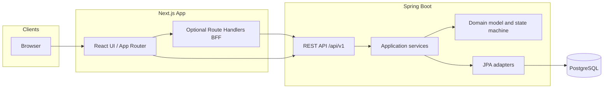

# Architecture

## Status

Draft

## Traceability

- Requirements: [requirements.md](./requirements.md)
- API: [api-contract.md](./api-contract.md)
- Data: [data-model.md](./data-model.md)
- Workflow: [state-machine.md](./state-machine.md)
- Frontend: [ui-flow.md](./ui-flow.md)

---

## System context

The browser loads the Next.js application. Data mutations and queries use JSON over HTTPS to the Spring Boot API (`/api/v1/...`). Next.js may proxy or attach auth headers via Route Handlers; domain rules are **never** duplicated only in the frontend.

---

## Architectural goals

| Goal | Approach |
| --- | --- |
| Spec-driven delivery | Behavior originates in `/spec`; code implements it |
| Clear boundaries | JPA entities ≠ API DTOs; controllers stay thin |
| Single source of truth for workflow | Status transitions validated in domain/application layer, not only in UI |
| Independent deployability | Backend and frontend are separate artifacts; contract is [api-contract.md](./api-contract.md) |
| Testability | Domain and state machine unit-tested without Spring; integration tests with Testcontainers |

---

## Backend (Spring Boot)

### Bounded context

One primary context: **ticket** (tickets, comments, lifecycle). Package by context under the application root, for example:

- `...ticket.api` — controllers, request/response records, exception mapping
- `...ticket.application` — use cases, transaction boundaries
- `...ticket.domain` — aggregates, status machine, domain exceptions
- `...ticket.infrastructure` — JPA entities, repositories, mappers

User identity is consumed as authenticated principal ID and roles from Spring Security; user profile storage is out of scope for v1 except as UUID references on tickets.

### Layer responsibilities

| Layer | Responsibility |
| --- | --- |
| **API** | HTTP mapping, validation (`@Valid`), authz checks at resource level, Problem Details via `@ControllerAdvice` |
| **Application** | Orchestrate repositories, invoke domain transition logic, publish optional domain events (logging only in v1) |
| **Domain** | Invariants, `TicketStatus` transitions, rejection of illegal events |
| **Infrastructure** | PostgreSQL persistence, mapping entity ↔ domain |

### Transactions

- `@Transactional` on application services that create or update tickets and comments.
- Read-only list/get: `@Transactional(readOnly = true)`.
- Optimistic locking: ticket `version` column; conflict returns `409` with `TICKET_VERSION_CONFLICT`.

### State machine placement

The transition table in [state-machine.md](./state-machine.md) is implemented as pure domain logic (enum + exhaustive switch or small policy class). Application service loads aggregate, calls domain, persists. Controllers do not embed transition rules.

### Security

- Stateless **Bearer JWT** or session cookies per deployment; spec assumes Bearer JWT for API examples.
- Spring Security: authenticate all `/api/v1/**` except health/actuator.
- Method-level or custom permission checks: Requester vs Agent rules from [requirements.md](./requirements.md).
- CORS: explicit Next.js origin; no `*` with credentials.

### Observability

- Spring Boot Actuator health for liveness/readiness.
- Request correlation ID propagated to logs (`traceId` in error responses when available).

---

## Frontend (Next.js)

### Responsibilities

- Routing, layout, forms, client-side validation (UX only; server remains authoritative).
- Server Components or client components for ticket list/detail; data fetching via `fetch` to backend or BFF.
- Display Problem Details errors (`title`, `detail`, `code`) to users.
- Status action buttons driven by allowed transitions (client may compute from current status for UX; server enforces truth).

### Non-responsibilities

- Authoritative workflow rules (must match API outcomes).
- Direct database access.

### Suggested structure

- `app/tickets` — list, `[ticketId]` detail, `new` create
- `lib/api` — typed client for [api-contract.md](./api-contract.md)
- `components/tickets` — table, filters, status actions, comment thread

Auth: store token per team standard (httpOnly cookie via BFF or secure client storage); details are deployment-specific and not part of v1 domain spec.

---

## Data store

PostgreSQL holds tickets and comments. Migrations via Flyway or Liquibase (team choice). Schema in [data-model.md](./data-model.md).

Search: v1 uses SQL `ILIKE` or PostgreSQL full-text on title/description; index strategy documented in data model.

---

## Deployment view (logical)

| Component | Runtime |
| --- | --- |
| `ticket-api` | JVM 21, Spring Boot executable JAR |
| `ticket-web` | Node.js, Next.js standalone output |
| `postgres` | Managed or container |

Environments: `dev`, `staging`, `prod`. Configuration via environment variables and `application.yml`; no secrets in repository.

---

## Key integration flows

### Create ticket

1. UI submits create form → `POST /api/v1/tickets`
2. Application service creates domain ticket `OPEN`, persists, returns `201`

### Progress ticket

1. UI sends transition → `POST /api/v1/tickets/{id}/transitions`
2. Domain validates `(status, event)` → new status or exception
3. Persist with version check → `200` or `409`

### List with filter and search

1. UI builds query string → `GET /api/v1/tickets?...`
2. Repository query with status filter and keyword predicate → page envelope

---

## Risks and mitigations

| Risk | Mitigation |
| --- | --- |
| UI shows transition button backend rejects | Disable buttons using same transition table as spec; integration tests |
| Concurrent edits | Optimistic locking on ticket |
| Search performance | Indexes; limit `size` max (e.g. 100) |

---

## Related decisions (implicit)

- UUID primary keys for tickets and comments.
- Comments stored separately, not embedded JSON array on ticket row.
- Status changes only via `/transitions`, not raw `status` on PATCH.
