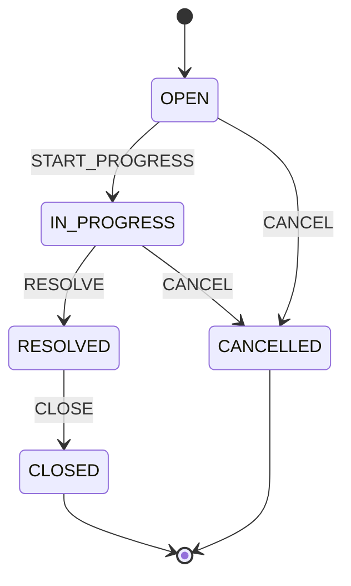

# Ticket Status State Machine

## Status

Draft

## Traceability

- Requirements: TCK-05 in [requirements.md](./requirements.md)
- API: [api-contract.md](./api-contract.md)
- Tests: [test-strategy.md](./test-strategy.md)

The **backend** is the authority. Every transition attempt that is not listed as allowed below must be rejected with HTTP `409` and code `TICKET_ILLEGAL_TRANSITION`.

---

## States

| State | Description | Terminal |
| --- | --- | --- |
| `OPEN` | Ticket created; not yet being worked | No |
| `IN_PROGRESS` | Agent is actively working the ticket | No |
| `RESOLVED` | Fix or answer provided; awaiting closure | No |
| `CLOSED` | Successfully completed | Yes |
| `CANCELLED` | Withdrawn or voided | Yes |

**Initial state on create:** `OPEN`

**Terminal states:** `CLOSED`, `CANCELLED` — no outgoing transitions.

---

## Events

Events are commands sent via `POST .../transitions` (not direct status assignment).

| Event | Meaning |
| --- | --- |
| `START_PROGRESS` | Begin work (`OPEN` → `IN_PROGRESS`) |
| `RESOLVE` | Mark work complete (`IN_PROGRESS` → `RESOLVED`) |
| `CLOSE` | Confirm closure (`RESOLVED` → `CLOSED`) |
| `CANCEL` | Cancel ticket (`OPEN` or `IN_PROGRESS` → `CANCELLED`) |

---

## Allowed transitions

| From | Event | Guard | To | Side effects |
| --- | --- | --- | --- | --- |
| `OPEN` | `START_PROGRESS` | Caller is `AGENT` or `ADMIN` | `IN_PROGRESS` | `updated_at` set; optional history row |
| `OPEN` | `CANCEL` | Caller is `AGENT` or `ADMIN` | `CANCELLED` | same |
| `IN_PROGRESS` | `RESOLVE` | Caller is `AGENT` or `ADMIN` | `RESOLVED` | same |
| `IN_PROGRESS` | `CANCEL` | Caller is `AGENT` or `ADMIN` | `CANCELLED` | same |
| `RESOLVED` | `CLOSE` | Caller is `AGENT` or `ADMIN` | `CLOSED` | same |

These implement the required paths:

- `OPEN` → `IN_PROGRESS` → `RESOLVED` → `CLOSED`
- `OPEN` → `CANCELLED`
- `IN_PROGRESS` → `CANCELLED`

---

## Illegal transitions (explicit)

Any `(fromStatus, event)` pair not in the allowed table is **forbidden**. Includes but is not limited to:

| From | Event | Reason |
| --- | --- | --- |
| `OPEN` | `RESOLVE` | Must start progress first |
| `OPEN` | `CLOSE` | Cannot close from open |
| `IN_PROGRESS` | `START_PROGRESS` | Already in progress |
| `IN_PROGRESS` | `CLOSE` | Must resolve before close |
| `RESOLVED` | `START_PROGRESS` | Cannot reopen via this machine |
| `RESOLVED` | `RESOLVE` | Already resolved |
| `RESOLVED` | `CANCEL` | Cancel not allowed after resolve |
| `CLOSED` | *any* | Terminal |
| `CANCELLED` | *any* | Terminal |
| `CLOSED` | `START_PROGRESS` | **Example:** cannot reopen `CLOSED` → `OPEN` |

**Reopening** (`CLOSED` → `OPEN`, `RESOLVED` → `OPEN`, etc.) is **not** supported in v1.

---

## Full transition matrix

Rows = current status, columns = event. Cell = resulting status or `—` if illegal.

| From \ Event | `START_PROGRESS` | `RESOLVE` | `CLOSE` | `CANCEL` |
| --- | --- | --- | --- | --- |
| `OPEN` | `IN_PROGRESS` | — | — | `CANCELLED` |
| `IN_PROGRESS` | — | `RESOLVED` | — | `CANCELLED` |
| `RESOLVED` | — | — | `CLOSED` | — |
| `CLOSED` | — | — | — | — |
| `CANCELLED` | — | — | — | — |

---

## Diagram

---

## Invariants

After every **successful** transition:

1. `status` equals the `To` column in the allowed table.
2. `version` increments by one.
3. `updated_at` advances (UTC).
4. `title`, `description`, `priority`, `requester_id` unchanged by transition API (field PATCH is separate).
5. If `ticket_status_history` is enabled, one row is appended with `from_status`, `to_status`, `event`, `actor_id`.

After every **rejected** transition:

1. `status` and `version` unchanged.
2. No history row appended.
3. API returns `TICKET_ILLEGAL_TRANSITION` (or `FORBIDDEN` if role guard fails).

---

## Guards

| Guard | Applies to | Failure |
| --- | --- | --- |
| Role `AGENT` or `ADMIN` | All transition events | `403 FORBIDDEN` |
| Ticket exists | All | `404 TICKET_NOT_FOUND` |
| Not terminal | All transitions | `409 TICKET_ILLEGAL_TRANSITION` if status is `CLOSED`/`CANCELLED` |

Assignee presence is **not** required to call `START_PROGRESS` in v1 (optional future guard).

---

## PATCH vs transitions

- `PATCH /tickets/{id}` must not accept `status` in the request body. If sent, `400` with `VALIDATION_ERROR` (unknown or disallowed field).
- Clients must use `/transitions` for lifecycle changes.

---

## UI hint mapping (non-normative)

| Current status | Suggested primary actions |
| --- | --- |
| `OPEN` | Start progress, Cancel |
| `IN_PROGRESS` | Resolve, Cancel |
| `RESOLVED` | Close |
| `CLOSED`, `CANCELLED` | None |

Server responses always override UI affordances.
